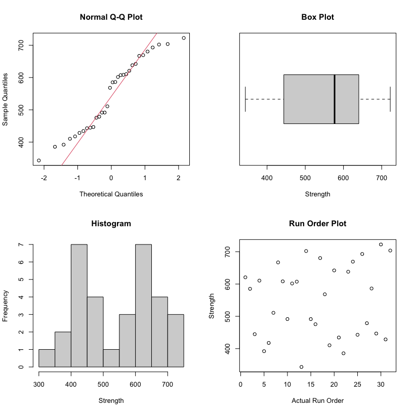
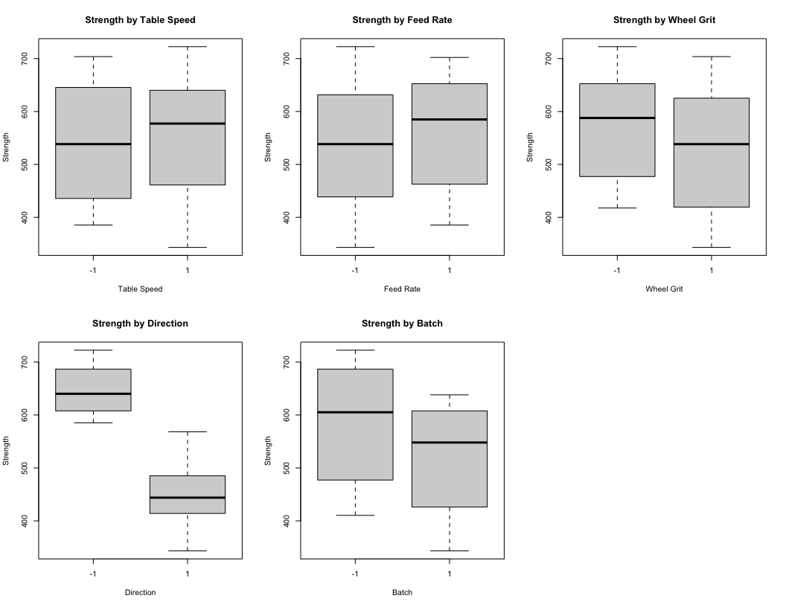

5.4.7.1. Full factorial example
================
Robert A. Stevens
2021-05-19

<https://www.itl.nist.gov/div898/handbook/pri/section4/pri471.htm>

## Data Source

*This example uses data from a NIST high performance ceramics
experiment*

This data set was taken from an experiment that was performed a few
years ago at NIST by Said Jahanmir of the Ceramics Division in the
Material Science and Engineering Laboratory. The original analysis was
performed primarily by Lisa Gill of the Statistical Engineering
Division. The example shown here is an independent analysis of a
modified portion of the original data set.

The original data set was part of a high performance ceramics experiment
with the goal of characterizing the effect of grinding parameters on
sintered reaction-bonded silicon nitride, reaction bonded silicone
nitride, and sintered silicon nitride.

Only modified data from the first of the three ceramic types (sintered
reaction-bonded silicon nitride) will be discussed in this illustrative
example of a full factorial data analysis.

The reader can download the data as a text file:

<https://www.itl.nist.gov/div898/handbook/datasets/CERAMIC.DAT>

## Description of Experiment: Response and Factors

*Response and factor variables*

Purpose: To determine the effect of machining factors on ceramic
strength Response variable = mean (over 15 repetitions) of the ceramic
strength Number of observations = 32 (a complete 25 factorial design)

  - Response Variable Y = Mean (over 15 reps) of Ceramic Strength

  - Factor 1 = Table Speed (2 levels: slow (0.025 m/s) and fast (0.125
    m/s))

  - Factor 2 = Down Feed Rate (2 levels: slow (0.05 mm) and fast (.125
    mm))

  - Factor 3 = Wheel Grit (2 levels: 140/170 and 80/100)

  - Factor 4 = Direction (2 levels: longitudinal and transverse)

  - Factor 5 = Batch (2 levels: 1 and 2)

Since two factors were qualitative (direction and batch) and it was
reasonable to expect monotone effects from the quantitative factors, no
centerpoint runs were included.

*The data*

The design matrix, with measured ceramic strength responses, appears
below. The actual randomized run order is given in the last column. (The
interested reader may download the data as a text file.)

<https://www.itl.nist.gov/div898/handbook/datasets/ceramic.dat>

``` 
   speed rate grit direction batch strength order
1     -1   -1   -1        -1    -1   680.45    17
2      1   -1   -1        -1    -1   722.48    30
3     -1    1   -1        -1    -1   702.14    14
4      1    1   -1        -1    -1   666.93     8
5     -1   -1    1        -1    -1   703.67    32
6      1   -1    1        -1    -1   642.14    20
7     -1    1    1        -1    -1   692.98    26
8      1    1    1        -1    -1   669.26    24
9     -1   -1   -1         1    -1   491.58    10
10     1   -1   -1         1    -1   475.52    16
11    -1    1   -1         1    -1   478.76    27
12     1    1   -1         1    -1   568.23    18
13    -1   -1    1         1    -1   444.72     3
14     1   -1    1         1    -1   410.37    19
15    -1    1    1         1    -1   428.51    31
16     1    1    1         1    -1   491.47    15
17    -1   -1   -1        -1     1   607.34    12
18     1   -1   -1        -1     1   620.80     1
19    -1    1   -1        -1     1   610.55     4
20     1    1   -1        -1     1   638.04    23
21    -1   -1    1        -1     1   585.19     2
22     1   -1    1        -1     1   586.17    28
23    -1    1    1        -1     1   601.67    11
24     1    1    1        -1     1   608.31     9
25    -1   -1   -1         1     1   442.90    25
26     1   -1   -1         1     1   434.41    21
27    -1    1   -1         1     1   417.66     6
28     1    1   -1         1     1   510.84     7
29    -1   -1    1         1     1   392.11     5
30     1   -1    1         1     1   343.22    13
31    -1    1    1         1     1   385.52    22
32     1    1    1         1     1   446.73    29
```

## Analysis of the Experiment

*Five basic steps*

The experimental data will be analyzed following the previously
described five basic steps:

<https://www.itl.nist.gov/div898/handbook/pri/section4/pri41.htm#DOE%20Analysis>

The analyses shown in this page can be generated using R code:

<https://www.itl.nist.gov/div898/handbook/pri/section4/pri471.r>

## Step 1: Look at the data

Plot the response variable We start by plotting the response data
several ways to see if any trends or anomalies appear that would not be
accounted for by the standard linear response models.

First, we look at the distribution of the response variable regardless
of factor levels by generating the following four plots.

1.  The first plot is a normal probability plot of the response variable
      - The red line is the theoretical normal distribution
      - <https://www.itl.nist.gov/div898/handbook/eda/section3/normprpl.htm>
2.  The second plot is a box plot of the response variable
      - <https://www.itl.nist.gov/div898/handbook/eda/section3/boxplot.htm>
3.  The third plot is a histogram of the response variable
      - <https://www.itl.nist.gov/div898/handbook/eda/section3/histogra.htm>
4.  The fourth plot is the response versus the run order.

<!-- -->

**4-plot: normal probability plot, box plot, histogram, run-order plot**

Clearly there is “structure” that we hope to account for when we fit a
response model. For example, the response variable is separated into two
roughly equal-sized clumps in the histogram. The first clump is centered
approximately around the value 450 while the second clump is centered
approximately around the value 650. As hoped for, the run-order plot
does not indicate a significant time effect.

*Box plots of response by factor variables*

Next, we look at box plots of the response for each factor.

<!-- -->

**box plots of response for each factor**

Several factors, most notably “Direction” followed by “Batch” and
possibly “Wheel Grit”, appear to change the average response level.

## Step 2: Create the theoretical model

*Theoretical model: assume all four-factor and higher interaction terms
are not significant*

For a 2^5 full factorial experiment we can fit a model containing a mean
term, five main effect terms, ten two-factor interaction terms, ten
three-factor interaction terms, five four-factor interaction terms, and
a five-factor interaction term (32 parameters). However, we start by
assuming all four-factor and higher interaction terms are non-existent.
It’s very rare for such high-order interactions to be significant, and
they are very difficult to interpret from an engineering viewpoint. The
assumption allows us to accumulate the sums of squares for these terms
and use them to estimate an error term. We start with a theoretical
model with 26 unknown constants, hoping the data will clarify which of
these are the significant main effects and interactions we need for a
final model.

## Step 3: Fit model to the data

*Results from fitting up to and including third-order interaction terms*

The ANOVA table for the 26-parameter model (intercept not shown)
follows.

    Summary of Fit

``` 
  RSquare = 0.9951266 
```

``` 
  RSquare Adj = 0.9748208 
```

``` 
  Root Mean Square Error = 17.81632 
```

``` 
  Mean of Response = 546.8959 
```

``` 
  Observations = 32
```

``` 
                      Df Sum Sq Mean Sq F value   Pr(>F)    
speed                  1    894     894   2.817 0.144250    
rate                   1   3497    3497  11.018 0.016019 *  
grit                   1  12664   12664  39.896 0.000735 ***
direction              1 315133  315133 992.790 6.79e-08 ***
batch                  1  33654   33654 106.023 4.90e-05 ***
speed:rate             1   4873    4873  15.350 0.007820 ** 
speed:grit             1   1839    1839   5.793 0.052802 .  
speed:direction        1   1637    1637   5.158 0.063573 .  
speed:batch            1    465     465   1.465 0.271637    
rate:grit              1    307     307   0.969 0.363033    
rate:direction         1   1973    1973   6.215 0.046974 *  
rate:batch             1    199     199   0.627 0.458472    
grit:direction         1   3158    3158   9.950 0.019705 *  
grit:batch             1     29      29   0.092 0.771312    
direction:batch        1   1329    1329   4.186 0.086715 .  
speed:rate:grit        1    357     357   1.125 0.329695    
speed:rate:direction   1   5896    5896  18.573 0.005039 ** 
speed:rate:batch       1    145     145   0.456 0.524698    
speed:grit:direction   1      2       2   0.007 0.937573    
speed:grit:batch       1     30      30   0.096 0.767571    
speed:direction:batch  1    545     545   1.716 0.238168    
rate:grit:direction    1     44      44   0.140 0.721008    
rate:grit:batch        1     26      26   0.081 0.786049    
rate:direction:batch   1    167     167   0.527 0.495168    
grit:direction:batch   1     32      32   0.102 0.759969    
Residuals              6   1905     317                     
---
Signif. codes:  0 '***' 0.001 '**' 0.01 '*' 0.05 '.' 0.1 ' ' 1
```

This fit has a large R^2 and adjusted R^2, but the high number of large
(\> 0.10) p-values (in the “Prob\>F” column) makes it clear that the
model has many unnecessary terms.

*Stepwise regression*

Starting with the 26 terms, we use stepwise regression to eliminate
unnecessary terms. By a combination of stepwise regression and the
removal of remaining terms with a p-value larger than 0.05, we quickly
arrive at a model with an intercept and 12 significant effect terms.

    Start:  AIC=182.76
    strength ~ (speed + rate + grit + direction + batch)^3
    
                            Df Sum of Sq    RSS    AIC
    - speed:grit:direction   1       2.1 1906.6 180.80
    - rate:grit:batch        1      25.6 1930.1 181.19
    - speed:grit:batch       1      30.4 1934.9 181.27
    - grit:direction:batch   1      32.5 1937.0 181.30
    - rate:grit:direction    1      44.5 1949.0 181.50
    <none>                               1904.5 182.76
    - speed:rate:batch       1     144.7 2049.2 183.10
    - rate:direction:batch   1     167.3 2071.8 183.46
    - speed:rate:grit        1     357.0 2261.6 186.26
    - speed:direction:batch  1     544.6 2449.1 188.81
    - speed:rate:direction   1    5895.6 7800.1 225.88
    
    Step:  AIC=180.8
    strength ~ speed + rate + grit + direction + batch + speed:rate + 
        speed:grit + speed:direction + speed:batch + rate:grit + 
        rate:direction + rate:batch + grit:direction + grit:batch + 
        direction:batch + speed:rate:grit + speed:rate:direction + 
        speed:rate:batch + speed:grit:batch + speed:direction:batch + 
        rate:grit:direction + rate:grit:batch + rate:direction:batch + 
        grit:direction:batch
    
                            Df Sum of Sq    RSS    AIC
    - rate:grit:batch        1      25.6 1932.2 179.22
    - speed:grit:batch       1      30.4 1937.0 179.30
    - grit:direction:batch   1      32.5 1939.1 179.34
    - rate:grit:direction    1      44.5 1951.1 179.53
    <none>                               1906.6 180.80
    - speed:rate:batch       1     144.7 2051.4 181.14
    - rate:direction:batch   1     167.3 2074.0 181.49
    - speed:rate:grit        1     357.0 2263.7 184.29
    - speed:direction:batch  1     544.6 2451.2 186.84
    - speed:rate:direction   1    5895.6 7802.3 223.89
    
    Step:  AIC=179.22
    strength ~ speed + rate + grit + direction + batch + speed:rate + 
        speed:grit + speed:direction + speed:batch + rate:grit + 
        rate:direction + rate:batch + grit:direction + grit:batch + 
        direction:batch + speed:rate:grit + speed:rate:direction + 
        speed:rate:batch + speed:grit:batch + speed:direction:batch + 
        rate:grit:direction + rate:direction:batch + grit:direction:batch
    
                            Df Sum of Sq    RSS    AIC
    - speed:grit:batch       1      30.4 1962.6 177.72
    - grit:direction:batch   1      32.5 1964.7 177.75
    - rate:grit:direction    1      44.5 1976.7 177.95
    <none>                               1932.2 179.22
    - speed:rate:batch       1     144.7 2076.9 179.53
    - rate:direction:batch   1     167.3 2099.5 179.88
    - speed:rate:grit        1     357.0 2289.3 182.65
    - speed:direction:batch  1     544.6 2476.8 185.17
    - speed:rate:direction   1    5895.6 7827.8 221.99
    
    Step:  AIC=177.72
    strength ~ speed + rate + grit + direction + batch + speed:rate + 
        speed:grit + speed:direction + speed:batch + rate:grit + 
        rate:direction + rate:batch + grit:direction + grit:batch + 
        direction:batch + speed:rate:grit + speed:rate:direction + 
        speed:rate:batch + speed:direction:batch + rate:grit:direction + 
        rate:direction:batch + grit:direction:batch
    
                            Df Sum of Sq    RSS    AIC
    - grit:direction:batch   1      32.5 1995.0 176.25
    - rate:grit:direction    1      44.5 2007.1 176.44
    <none>                               1962.6 177.72
    - speed:rate:batch       1     144.7 2107.3 178.00
    - rate:direction:batch   1     167.3 2129.9 178.34
    - speed:rate:grit        1     357.0 2319.6 181.07
    - speed:direction:batch  1     544.6 2507.2 183.56
    - speed:rate:direction   1    5895.6 7858.2 220.11
    
    Step:  AIC=176.25
    strength ~ speed + rate + grit + direction + batch + speed:rate + 
        speed:grit + speed:direction + speed:batch + rate:grit + 
        rate:direction + rate:batch + grit:direction + grit:batch + 
        direction:batch + speed:rate:grit + speed:rate:direction + 
        speed:rate:batch + speed:direction:batch + rate:grit:direction + 
        rate:direction:batch
    
                            Df Sum of Sq    RSS    AIC
    - grit:batch             1      29.4 2024.4 174.71
    - rate:grit:direction    1      44.5 2039.5 174.95
    <none>                               1995.0 176.25
    - speed:rate:batch       1     144.7 2139.8 176.49
    - rate:direction:batch   1     167.3 2162.4 176.82
    - speed:rate:grit        1     357.0 2352.1 179.51
    - speed:direction:batch  1     544.6 2539.6 181.97
    - speed:rate:direction   1    5895.6 7890.7 218.25
    
    Step:  AIC=174.71
    strength ~ speed + rate + grit + direction + batch + speed:rate + 
        speed:grit + speed:direction + speed:batch + rate:grit + 
        rate:direction + rate:batch + grit:direction + direction:batch + 
        speed:rate:grit + speed:rate:direction + speed:rate:batch + 
        speed:direction:batch + rate:grit:direction + rate:direction:batch
    
                            Df Sum of Sq    RSS    AIC
    - rate:grit:direction    1      44.5 2068.9 173.41
    <none>                               2024.4 174.71
    - speed:rate:batch       1     144.7 2169.1 174.92
    - rate:direction:batch   1     167.3 2191.7 175.25
    - speed:rate:grit        1     357.0 2381.4 177.91
    - speed:direction:batch  1     544.6 2569.0 180.34
    - speed:rate:direction   1    5895.6 7920.0 216.37
    
    Step:  AIC=173.41
    strength ~ speed + rate + grit + direction + batch + speed:rate + 
        speed:grit + speed:direction + speed:batch + rate:grit + 
        rate:direction + rate:batch + grit:direction + direction:batch + 
        speed:rate:grit + speed:rate:direction + speed:rate:batch + 
        speed:direction:batch + rate:direction:batch
    
                            Df Sum of Sq    RSS    AIC
    <none>                               2068.9 173.41
    - speed:rate:batch       1     144.7 2213.6 173.57
    - rate:direction:batch   1     167.3 2236.2 173.90
    - speed:rate:grit        1     357.0 2425.9 176.50
    - speed:direction:batch  1     544.6 2613.5 178.89
    - grit:direction         1    3158.3 5227.2 201.07
    - speed:rate:direction   1    5895.6 7964.5 214.54

``` 
                      Df Sum Sq Mean Sq  F value   Pr(>F)    
speed                  1    894     894    5.187 0.041862 *  
rate                   1   3497    3497   20.284 0.000722 ***
grit                   1  12664   12664   73.454 1.84e-06 ***
direction              1 315133  315133 1827.837 1.74e-14 ***
batch                  1  33654   33654  195.200 8.73e-09 ***
speed:rate             1   4873    4873   28.262 0.000183 ***
speed:grit             1   1839    1839   10.665 0.006756 ** 
speed:direction        1   1637    1637    9.496 0.009510 ** 
speed:batch            1    465     465    2.697 0.126440    
rate:grit              1    307     307    1.783 0.206520    
rate:direction         1   1973    1973   11.442 0.005442 ** 
rate:batch             1    199     199    1.155 0.303616    
grit:direction         1   3158    3158   18.319 0.001069 ** 
direction:batch        1   1329    1329    7.707 0.016767 *  
speed:rate:grit        1    357     357    2.071 0.175699    
speed:rate:direction   1   5896    5896   34.196 7.87e-05 ***
speed:rate:batch       1    145     145    0.839 0.377623    
speed:direction:batch  1    545     545    3.159 0.100855    
rate:direction:batch   1    167     167    0.970 0.344021    
Residuals             12   2069     172                      
---
Signif. codes:  0 '***' 0.001 '**' 0.01 '*' 0.05 '.' 0.1 ' ' 1
```

*Results from fitting the 12-term model*

``` 
            Summary of Fit
           RSquare 0.989114
           RSquare Adj 0.982239
     Root Mean Square Error 14.96346
      Mean of Response 546.8959
     Observations (or Sum Wgts) 32
```

``` 
                     Df Sum Sq Mean Sq  F value   Pr(>F)    
speed                 1    894     894    3.994 0.060170 .  
rate                  1   3497    3497   15.619 0.000855 ***
grit                  1  12664   12664   56.560 4.14e-07 ***
direction             1 315133  315133 1407.439  < 2e-16 ***
batch                 1  33654   33654  150.304 1.80e-10 ***
speed:rate            1   4873    4873   21.762 0.000169 ***
speed:grit            1   1839    1839    8.212 0.009896 ** 
speed:direction       1   1637    1637    7.312 0.014065 *  
rate:direction        1   1973    1973    8.810 0.007897 ** 
grit:direction        1   3158    3158   14.106 0.001338 ** 
direction:batch       1   1329    1329    5.935 0.024859 *  
speed:rate:direction  1   5896    5896   26.331 5.93e-05 ***
Residuals            19   4254     224                      
---
Signif. codes:  0 '***' 0.001 '**' 0.01 '*' 0.05 '.' 0.1 ' ' 1
```

    [1] 0.9822389

*Normal plot of the effects*

Non-significant effects should effectively follow an approximately
normal distribution with the same location and scale. Significant
effects will vary from this normal distribution. Therefore, another
method of determining significant effects is to generate a normal
probability plot of all 31 effects. The effects that deviate
substantially from the straight line fit to the data are considered
significant. Although this is a somewhat subjective criteria, it tends
to work well in practice. It is helpful to use both the numerical output
from the fit and graphical techniques such as the normal probability
plot in deciding which terms to keep in the model.

A normal probability plot of the effects is shown below. (To reduce the
scale of the y-axis, the largest two effects, X4: Direction and X5:
Batch, are not shown on the plot. In addition, these two effects were
not used to compute the normal reference line.) The effects we consider
to be significant are labeled. In this case, we have arrived at the
exact same 12 terms by looking at the normal probability plot as we did
from the stepwise regression.

Normal plot of the 31 effects

Most of the effects cluster close to the center (zero) line and follow
the fitted normal model straight line. The effects that appear to be
above or below the line by more than a small amount are the same effects
identified using the stepwise routine, with the exception of X1. Some
analysts prefer to include a main effect term when it has several
significant interactions even if the main effect term itself does not
appear to be significant.

*Model appears to account for most of the variability*

At this stage, the model appears to account for most of the variability
in the response, achieving an adjusted R2 of 0.982. All the main effects
are significant, as are six 2-factor interactions and one 3-factor
interaction. The only interaction that makes little physical sense is
the " X4: Direction\*X5: Batch" interaction - why would the response
using one batch of material react differently when the batch is cut in a
different direction as compared to another batch of the same
formulation?

However, before accepting any model, residuals need to be examined.

## Step 4: Test the model assumptions using residual graphs (adjust and simplify as needed)

*Plot of residuals versus predicted responses*

First we look at the residuals plotted versus the predicted responses.

Plot of residuals versus predicted response

The residuals appear to spread out more with larger values of predicted
strength, which should not happen when there is a common variance.

Next we examine the distribution of the residuals with a normal quantile
plot, a box plot, a histogram, and a run-order plot.

Normal probability plot, box plot, and histogram of the residuals

None of these plots appear to show typical normal residuals and the
boxplot indicates that there may be outliers.

## Step 4 continued: Transform the data and fit the model again

*Box-Cox Transformation*

We next look at whether we can model a transformation of the response
variable and obtain residuals with the assumed properties. We calculate
an optimum Box-Cox transformation by finding the value of lambda that
maximizes the negative log likelihood.

Box-Cox transformation graph, optimal value at lambda = 0.2

The optimum is found at lambda = 0.2. A new Y: Strength variable is
calculated using:

Box-Cox transformation

*Fit model to transformed data*

When the 12-effect model is fit to the transformed data, the “X4:
Direction \* X5: Batch” interaction term is no longer significant. The
11-effect model fit is shown below, with parameter estimates and
p-values.

*The fitted model after applying Box-Cox transformation*

``` 
    The 11-Effect Model Fit to Tranformed Response Data

               Response:    Y:NewStrength

                  Summary of Fit
               RSquare 0.99041
               RSquare Adj 0.985135
         Root Mean Square Error 13.81065
          Mean of Response 1917.115
         Observations (or Sum Wgts) 32

                       Parameter
Effect                  Estimate         p-value
Intercept               1917.115          <.0001
X1: Table Speed            5.777          0.0282
X2: Feed Rate             11.691          0.0001
X1: Table Speed*         -14.467          <.0001
    X2: Feed Rate
X3: Wheel Grit           -21.649          <.0001
X1: Table Speed*           7.339          0.007
    X3: Wheel Grit
X4: Direction            -99.272          <.0001
X1: Table Speed*          -7.188          0.0080
    X4: Direction
X2: Feed Rate*            -9.160          0.0013
    X4: Direction
X1: Table Speed*          15.325          <.0001
    X2: Feed Rate*
    X4:Direction
X3: Wheel Grit*           12.965          <.0001
    X4: Direction
X5: Batch                -31.871          <.0001
```

*Model has high R2*

This model has a very large R2 and adjusted R2. The residual plots
(shown below) are quite a bit better behaved than before

*Residual plots from model with transformed response*

The plot of the residuals versus the predicted values indicates that the
transformation has resolved the problem of increasing variace with
increasing strength.

residual vs predicted

The normal probability plot, box plot, and the histogram of the
residuals do not indicate any serious violations of the model
assumptions:

<https://www.itl.nist.gov/div898/handbook/eda/section3/normprpl.htm>

<https://www.itl.nist.gov/div898/handbook/eda/section3/boxplot.htm>

<https://www.itl.nist.gov/div898/handbook/eda/section3/histogra.htm>

The run sequence plot of the residuals does not indicate any time
dependent patterns.

<https://www.itl.nist.gov/div898/handbook/eda/section3/runseqpl.htm>

Normal prob. plot, box plot, histogram, & run-order plot of residuals

## Step 5. Answer the questions in your experimental objectives

*Important main effects and interaction effects*

The magnitudes of the effect estimates show that “Direction” is by far
the most important factor. “Batch” plays the next most critical role,
followed by “Wheel Grit”. Then, there are several important interactions
followed by “Feed Rate”. “Table Speed” plays a role in almost every
significant interaction term, but is the least important main effect on
its own. Note that large interactions can obscure main effects.

*Plots of the main effects and significant 2-way interactions*

Plots of the main effects and the significant 2-way interactions are
shown below.

Plots of the main effects

Plots of significant 2-way interactions

Next, we plot 2-way interaction plot showing means for all combinations
of levels for the two factors.

Plots of significant 2-way interactions

The labels located in the diagonal spaces of the plot grid have two
purposes. First, the label indicates the factor associated with the
x-axis for all plots in the same row. Second, the label indicates the
factor defining the two lines for plots in the same column.

For example, the plot labeled r*s contains averages for low and high
levels of the rate variable (x-axis) for both levels of speed. The blue
line represents the low level of speed and the pink line represents the
high level of speed. The two lines in the r*s plot cross, indicating
that there is interaction between rate and speed. Parallel lines
indicate that there is no interaction between the two factors.

*Optimal Settings*

Based on the analyses, we can select factor settings that maximize
ceramic strength. Translating from “-1” and “+1” back to the actual
factor settings, we have: Table speed at “1” or .125m/s; Down Feed Rate
at “1” or .125 mm; Wheel Grit at “-1” or 140/170; and Direction at “-1”
or longitudinal.

Unfortunately, “Batch” is also a very significant factor, with the first
batch giving higher strengths than the second. Unless it is possible to
learn what worked well with this batch, and how to repeat it, not much
can be done about this factor.

## Comments

*Analyses with value of Direction fixed indicates complex model is
needed only for transverse cut*

One might ask what an analysis of just the 2^4 factorial with
“Direction” kept at -1 (i.e., longitudinal) would yield. This
analysis turns out to have a very simple model; only “Wheel Grit” and
“Batch” are significant main effects and no interactions are
significant.

If, on the other hand, we do an analysis of the 2^4 factorial with
“Direction” kept at +1 (i.e., transverse), then we obtain a
7-parameter model with all the main effects and interactions we saw in
the 2^5 analysis, except, of course, any terms involving “Direction”.

So it appears that the complex model of the full analysis came from the
physical properties of a transverse cut, and these complexities are not
present for longitudinal cuts.

*Half fraction design*

If we had assumed that three-factor and higher interactions were
negligible before experimenting, a 2\_V^(5−1) half fraction design might
have been chosen. In hindsight, we would have obtained valid estimates
for all main effects and two-factor interactions except for X3 and X5,
which would have been aliased with X1*X2*X4 in that half fraction.

*Natural log transformation*

Finally, we note that many analysts might prefer to adopt a natural
logarithm transformation (i.e., use ln(Y)) as the response instead of
using a Box-Cox transformation with an exponent of 0.2. The natural
logarithm transformation corresponds to an exponent of λ = 0 in the
Box-Cox graph.
